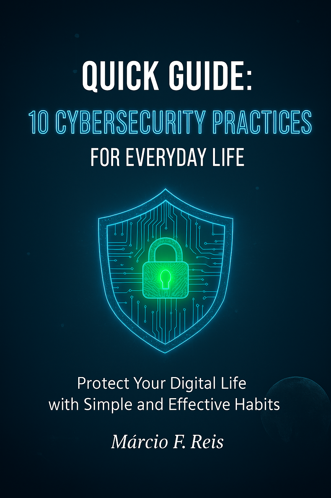

# 📚 Quick Guide: 10 Key Digital Security Practices

## 📖 About the Project
A complete ebook on digital security developed using advanced prompt engineering techniques with Gemini, DeepSeek, and ChatGPT. This project demonstrates the ability to create high-quality technical content in a structured and efficient way.

## 🎯 Objective
To provide a practical and accessible guide for people without in-depth technical knowledge to adopt robust digital security habits in their daily lives.

## ✨ Project Highlights
- **54 pages** of dense and practical content
- **10 chapters** covering everything from passwords to security mindset
- **Real-world** and verifiable case studies
- **Academic** and technical references
- **Professional design** following editorial standards

## 🛡️ Chapters
1. Strong Passwords and Two-Factor Authentication
2. Identifying and Avoiding Phishing
3. Importance of Software Updates
4. Protection with Virtual Private Networks (VPNs)
5. 3-2-1 Backup Strategies
6. Controlling Your Digital Footprint
7. Effective Antivirus and Firewalls
8. Mobile Security
9. Secure Browsing
10. Continuous Security Mindset

## 🛠️ Technologies and Methodologies
- **Advanced Prompt Engineering**
- **Research** Technical **with primary sources**
- Professional **Technical Writing**
- **Editorial Design** following military standards
- **Versioning** with Git

## 📁 Repository Structure
